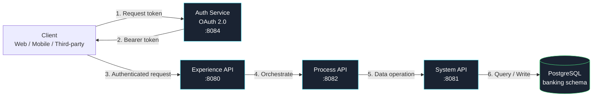

# BankGate — Architecture & Final Documentation

This document consolidates the architecture, testing summary, and deployment notes into one reference, supplementing the [README](README.md) and [API_REFERENCE.md](API_REFERENCE.md).

---

## Architecture Diagram

*(Renders automatically in GitHub's markdown viewer.)*

---

## Tier Responsibilities

| Tier | Owns | Never does |
|---|---|---|
| Experience | Public contract, OAuth token validation | Business logic, database access |
| Process | Orchestration, cross-module coordination | Direct database access |
| System | Business logic, validation, database access | Exposing itself directly to end clients |
| Auth | Token issuance and validation | Business data of any kind |

Only `system-api` holds a `db:config` connection — this is the single most important architectural constraint in the project, since it keeps the data-access boundary at one auditable layer.

---

## Testing Summary

| Suite | Tests | Status |
|---|---|---|
| customer-tests.xml | 7 | ✅ Passing |
| account-tests.xml | 7 | ✅ Passing |
| kyc-tests.xml | 6 | ✅ Passing |
| transaction-tests.xml | 8 | ✅ Passing |
| dashboard-tests.xml | 16 | ✅ Passing |
| **Total** | **44** | **✅ 44/44, 0 errors, 0 failures** |

Testing patterns established during development (see [CONTRIBUTING.md](CONTRIBUTING.md) for the reusable versions):
- `munit-tools:` namespace for mocking, not `munit:`
- `flowSucceeded` boolean-variable pattern for happy-path assertions
- Core `try`/`error-handler` wrapping for asserting on raised error types

---

## Deployment Notes

- **Packaging:** All four apps build cleanly via `mvn clean package` (BUILD SUCCESS on all four).
- **Embedded runtime (Studio):** Fully verified — every endpoint tested against this runtime via Postman and MUnit throughout development.
- **Standalone runtime (outside Studio):** Packaging and deployment mechanics verified — all four apps reached `DEPLOYED` status simultaneously with no port conflicts after resolving a duplicate-deployment-folder issue. Sustained operation was not achieved due to an unresolved Windows-specific Java Service Wrapper timeout; several causes were ruled out (ports, duplicate deployments, antivirus, leftover processes) without a confirmed root cause. This is documented honestly rather than worked around — see [README — Assumptions and Limitations](README.md#assumptions-and-limitations).

---

## Governance

- RAML contract published to Anypoint Exchange as **BankGate API v1.0.0**
- Registered in API Manager (API ID `21097166`)
- Rate-limiting policy applied and verified — a real `HTTP 429` returned on the 6th rapid request against the configured limit

---

## What's Deliberately Out of Scope

Documented here rather than silently omitted:
- **Retry/resilience logic** — not yet implemented; when added, should apply only to Process→System calls for transient failures, explicitly excluding retries on already-committed database writes
- **Audit trail** — a `banking.audit_log` table and inserts on key events, not yet implemented
- **KYC → Account business rule** — deferred pending further business-input decisions, not yet implemented
- **Sustained standalone runtime operation on Windows** — see Deployment Notes above
